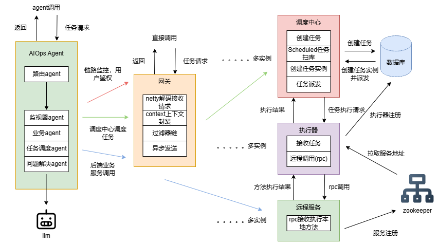

------

#  My-Scheduler

> 基于自研 RPC 框架与自研 HTTP 网关实现的分布式任务调度系统

------

## 项目简介

My-Scheduler 是一个从零实现的分布式任务调度系统，包含：

- 自研 RPC 框架（Netty + ZooKeeper + 自定义协议）
- 自研高性能 HTTP 网关（Netty + 责任链 + 熔断 + 负载均衡）
- 分布式调度中心（软超时 / 重试 / 多节点调度 / 健康检查）

本项目旨在深入理解：

- 分布式调度原理
- 状态机设计
- 超时控制与幂等保障
- 熔断与重试机制
- 多节点协调与一致性问题

------


#  系统整体架构



#  调度中心架构

```
                ┌────────────────────────┐
                │    scheduler-admin     │
                │     调度中心（控制面）   │
                └─────────────┬──────────┘
                              │ HTTP
                              ▼
                ┌────────────────────────┐
                │   scheduler-executor   │
                │      执行节点（数据面）  │
                └────────────────────────┘
```

系统采用 **Admin / Executor 分离架构**：

| 模块               | 职责                                             |
| ------------------ | ------------------------------------------------ |
| scheduler-admin    | 任务管理、调度触发、派发执行、超时检测、失败重试 |
| scheduler-executor | 实际执行任务并回执结果                           |
| scheduler-common   | DTO 与协议定义                                   |

------

# 核心功能

## 任务调度

- 支持 `FIXED_RATE`
- 支持 `CRON`
- 独立调度引擎线程

------

##  状态机模型

任务执行状态流转：

```
WAITING
   │
   ▼
RUNNING
   ├── SUCCESS
   ├── FAILED
   └── TIMEOUT
```

所有状态转换必须通过 **CAS 条件更新** 实现：

```sql
update job_instance
set status = 'SUCCESS'
where id = ?
and status = 'RUNNING'
```

确保：

- 不会被重复回执污染
- 不会被乱序回执覆盖
- 状态流转具有确定性

------

##  软超时机制（核心亮点）

### 问题

当任务执行时间超过 timeoutMs 时：

- executor 可能仍会返回 SUCCESS
- 若无保护可能污染状态

### 解决方案

1. RUNNING 时写入 `deadline_time`
2. TimeoutWatcher 扫描 `deadline_time <= now`
3. 回执更新必须满足：

```sql
where status = 'RUNNING'
```

从而保证：

- 超时与成功竞争只会成功一次
- 乱序回执不会污染最终状态

------

##  重试机制

- 支持 retryMax
- 独立 RetryRunner 扫描
- TIMEOUT / FAILED 且 retry_count < retryMax → 重新进入 WAITING
- 支持自动重试

------

##  节点健康检查

- Executor 启动自动注册
- 定时心跳
- Admin 定期扫描超时节点 → 标记 OFFLINE
- 调度自动避开异常节点

------

## 路由与负载均衡

- RoundRobin 轮询路由
- 支持 Failover
- 多节点自动切换

------

# 调度闭环流程

1. TriggerEngine 生成 WAITING 实例
2. DispatcherRunner 派发任务
3. Executor 执行任务
4. 回执上报 ExecutionReport
5. Admin 更新状态
6. TimeoutWatcher 检测超时
7. RetryRunner 控制重试

形成完整闭环。

------

# 核心数据模型

## Job

| 字段         | 说明               |
| ------------ | ------------------ |
| scheduleType | FIXED_RATE / CRON  |
| scheduleExpr | 间隔或 cron 表达式 |
| timeoutMs    | 超时时间           |
| retryMax     | 最大重试次数       |

------

## JobInstance

| 字段          | 说明                                           |
| ------------- | ---------------------------------------------- |
| status        | WAITING / RUNNING / SUCCESS / FAILED / TIMEOUT |
| start_time    | 开始时间                                       |
| deadline_time | 超时时刻                                       |
| end_time      | 结束时间                                       |
| retry_count   | 已重试次数                                     |

------

# 关键设计思想

## 状态机驱动

系统以 JobInstance 状态机为核心，不依赖内存态控制。

------

## 幂等保障

所有更新均通过条件 SQL 控制：

- RUNNING → SUCCESS
- RUNNING → TIMEOUT

避免：

- 重复回执
- 回执乱序
- 多线程竞争

------

##  软超时 vs 硬超时

| 类型   | 说明                           |
| ------ | ------------------------------ |
| 软超时 | Admin 标记 TIMEOUT，不强制中断 |
| 硬超时 | Executor 侧 Future.cancel      |

当前实现为软超时，可扩展为硬超时。

------

## 分层设计

- 调度逻辑与执行逻辑分离
- 控制面与数据面分离
- 状态驱动而非线程驱动

------

# 本地运行方式

## 启动数据库

创建相关表：

- job
- job_instance
- executor_node
- job_schedule_state

------

## 启动 Admin

```
cd scheduler-admin
mvn spring-boot:run
```

默认端口：9001

------

## 启动 Executor

```
cd scheduler-executor
mvn spring-boot:run
```

默认端口：9002

------

## 创建任务示例

```json
{
  "name": "demo-job",
  "scheduleType": "FIXED_RATE",
  "scheduleExpr": "3000",
  "handlerType": "HTTP",
  "handlerParam": "{\"url\":\"http://127.0.0.1:9002/health\",\"method\":\"GET\"}",
  "retryMax": 2,
  "timeoutMs": 2000,
  "enabled": true
}
```

------

# 技术难点与解决方案

### 软超时竞争问题

问题：

- timeout = 2000ms
- duration = 5000ms 仍 SUCCESS

原因：

- watcher 延迟
- 回执晚到

解决：

- deadline_time
- CAS 条件更新

------

### 重复回执污染

解决：

```sql
where status = 'RUNNING'
```

------

### 多节点派发失败

解决：

- 轮询 + failover
- markWaitingFromRunning 回滚机制

------

# 可扩展方向

- 多 Admin 抢占式调度
- 分片调度
- 分布式锁
- 硬超时
- 任务依赖 DAG
- 调度日志追踪
- 指标监控

------

#  项目亮点总结

- 自研 RPC 框架
- 自研 HTTP 网关
- 分布式调度核心算法
- 状态机驱动设计
- 软超时与幂等保障
- 健康检查与故障转移

------

# 项目评价

该项目重点不在功能堆砌，而在于：

- 状态一致性设计
- 调度系统核心机制实现
- 分布式系统边界条件处理

适合作为后端实习 / 中间件方向项目展示。

------

